## Exploratory Data Analysis/Model Prediction

-   Motivation:

For decades, climate change has been a heated topic worldwide. While we all have heard about climate change and global warming, it seems a broad and far-away question. However, it is actually a very urgent issue. With climate impacts becoming increasingly intertwined with our everyday lives, climate change is no longer a far-off threat. Under such circumstance, we should know what's our roles in climate change; how climate changes impact us; how can we change the climate if the object is enormous compared to our effort. Our group felt intrigued and responsible for investigating the relationship between human activities and climate change. It is a very meaningful subject to dig into because climate change is threatening the way we live and the future of our planet. Having a clearer understanding of it helps to improve the environment and human welfare. Specifically, in our analysis, we inspect the relationship between the growth of countries and their impacts to climate change which is greenhouse gas emissions. Our study investigates the greenhouse gas emissions from 1990-2018 for countries worldwide. Our data includes some demographic variables such as population and GDP and data from two major sectors which are agricultural land and energy, as they are the most vital aspects of human life and the foundation of a country's growth. And the variables in these two sectors include energy_per_capita, energy_per_gdp, primary_energy_consumption, Source_of_emissions, Agriculture_emissions(kilotonnes), total_ghg(kilotonnes), agri_ghg_total. Through our analysis, we could answer the following questions: 1. What is the trend of greenhouse gas emissions, and how did it change through the years? 2. How energy and agriculture sectors are impacting greenhouse gas emissions? 3. Does greenhouse gas emission inevitably followed by GDP growth or industry development? 4. Which countries are more sustainable than others/ which countries contribute more emissions than other countries? 5. Based on our project, can we predict where we are heading? 6. Can we come up with any suggestions for being more sustainable?

-   Limitations:

Although we aim to map emissions worldwide, there are gaps in our dataset that disabled us from analyzing some specific areas. For instance, many developing countries are not equipped with enough resources to record detailed sector-based emission data, and we could only obtain the total emission from that country. As a result, our analysis is a partial representation of the world emission trend. Additionally, as our datasets have many objectives, we only include in-depth analysis for the top emitter to ensure the clarity of the graphs. To address this information, we will use our interactive as a tool to enable the audience to explore their interests. Moreover, many contributors to greenhouse gas emissions exist, and our analysis only touched a little. These datasets are chosen based on our question of interest, and they probably are not the best to describe the greenhouse gas emission trend. In the future, we could deepen our study by selecting different sectors of human activity and analyzing the impact to provide a more comprehensive model.

## **Section 1: Visualized graphs**

-   1.1 Global Emission trend over the year

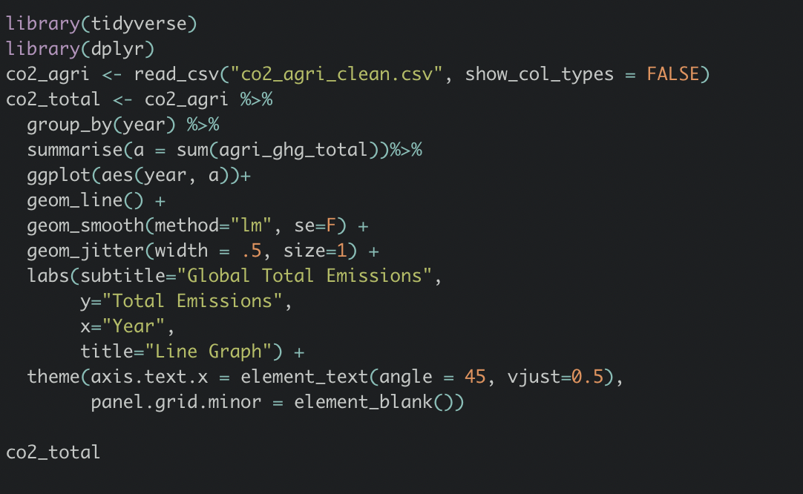

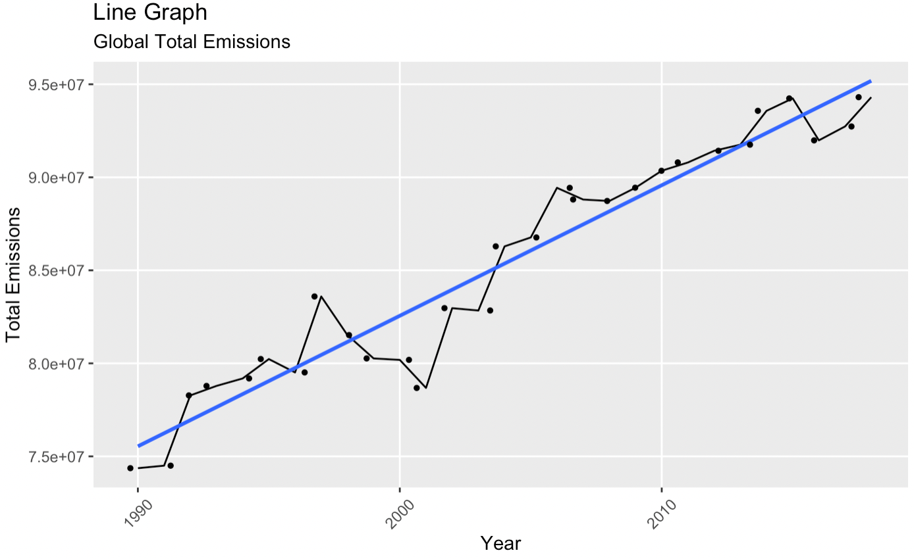

In this graph, we plotted the trend of global greenhouse gas emissions from 1990 to 2018. The dots represent the amount of greenhouse gas emission from all countries added in the corresponding year, and the blue line is a fitted trend line. Overall, there has been a gradual increase in total emissions. However, as we can see on the graph, there are many fluctuations from time to time, especially before 2003, when the highs and lows are extreme. After 2003, the level of greenhouse gas emissions starts to align at a stable level, but there are ups and downs still. As we saw these trends, we wondered, if the emission is only affected by the number of emitters or some other familiar sources, what would cause such large fluctuations? During 1997 and 2003, when emissions started falling for several years, we noticed that during that period, a stock market crash in the United States was caused by an economic crisis in Asia. Every emission trend seems to tie up with economic growth and political events. Therefore, from this starting point, we narrowed down our object to the world's largest emitters as our representatives to inspect closely how these factors have impacted their emission trend. And we included GDP and population size as indicators in our analysis to illustrate the relationship between economical factors and greenhouse gas emissions.

-   1.2 Rank the countries according to their contributions to CO2 emissions

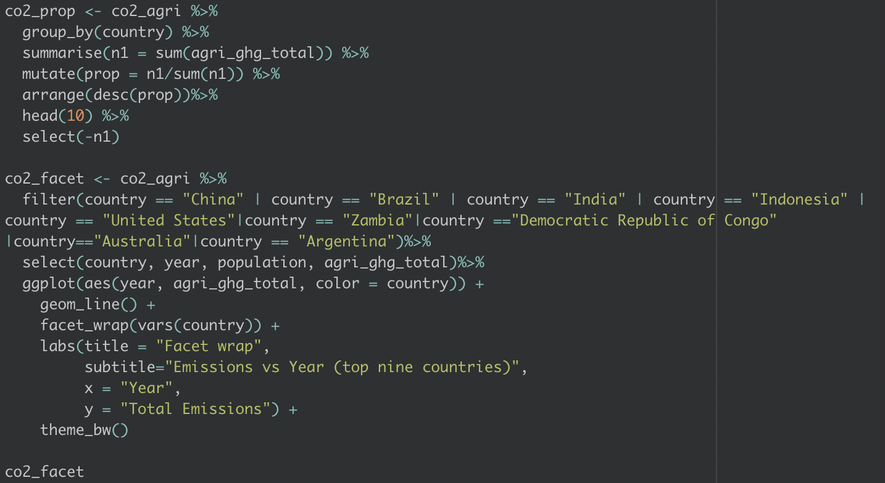

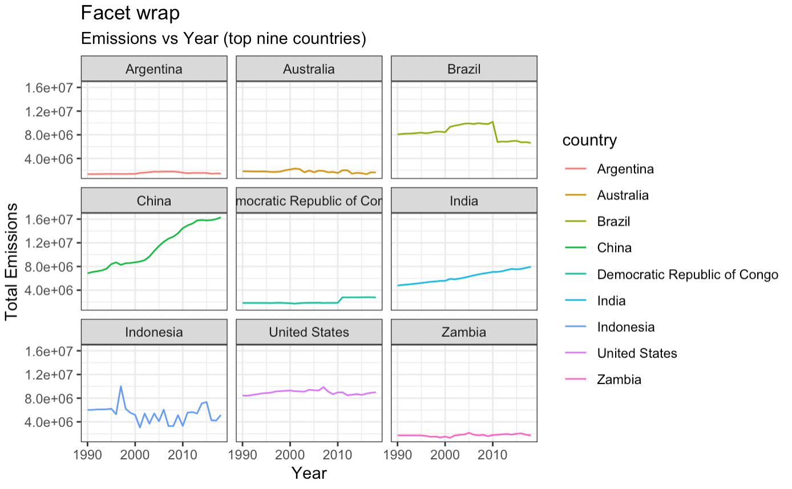

This plot exhibits the top nine emitters in the world and their emission trends over the years. We used facet wrap to compare the difference in their emission distribution easily. Most countries showed a steadily increased pattern, but Brazil, China, India, the United States, and Indonesia have a shift in their emission trends in a specific time frame. China, in particular, has had an obvious increasing trend through the years, which corresponds to the growing GDP and improving economical policies during these years. Besides, the US, Brazil, Indonesia, and India have either an increasing trend or obvious fluctuations throughout the years.

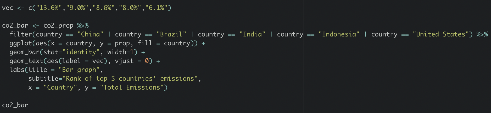

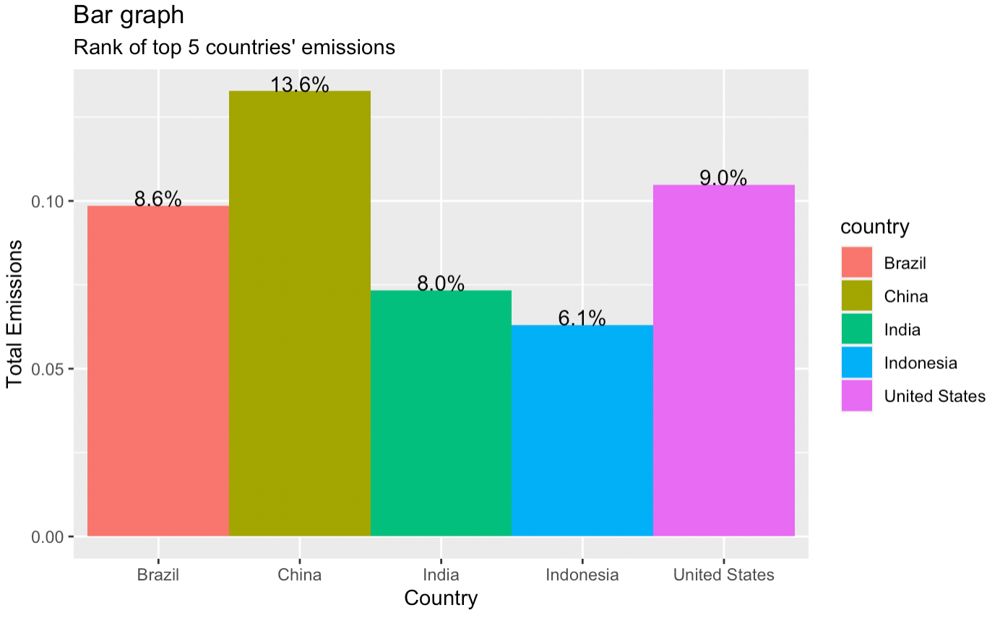

Coincidentally, the five countries which have the most obvious trend in greenhouse gas emissions are also the top five countries that contribute most to total greenhouse gas emissions. As a result, we chose to focus on these five countries to represent the rest of the world. This caught us thinking, what is common among these large emitters? In order to find out the reasons which cause the top emissions in these countries, we need to analyze more factors relating to greenhouse gas emissions.

-   1.3 GDP and Population of top 5 countries

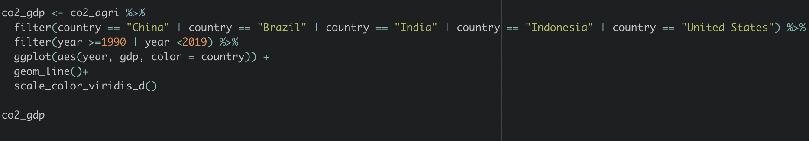

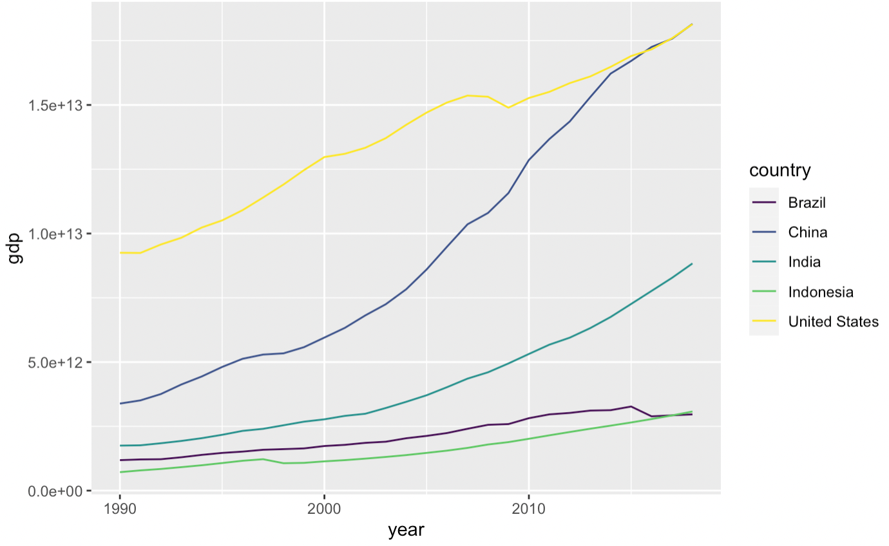

In previous research, we found that economical trends and some domestic indexes are crucial to understanding why some countries have higher greenhouse gas emissions than other countries. So we chose GDP as an indicator representing the economical factors. In this line plot, China has the steepest increasing line among the five countries. The pattern of the GDP line corresponds to the total emission line, and so do the lines of the US and India. So we could predict that higher GDP leads to higher greenhouse gas emissions because the increased production of industries due to economic growth leads to carbon intensity in these two countries. Meanwhile, the trends in Brazil and Indonesia didn't present an obvious relationship with the trends of greenhouse gas emissions. Take Brazil as an example, this time frame overlaps with the robust period of Brazil's economic growth and ends shortly before the collapse of the Brazilian economy. Also, Indonesia did not exhibit such a clear pattern for us to investigate. Since Indonesia is a growing economy with a lot of change in terms of social structures, we assume that this trend aligns with their effort in implementing developmental policies.

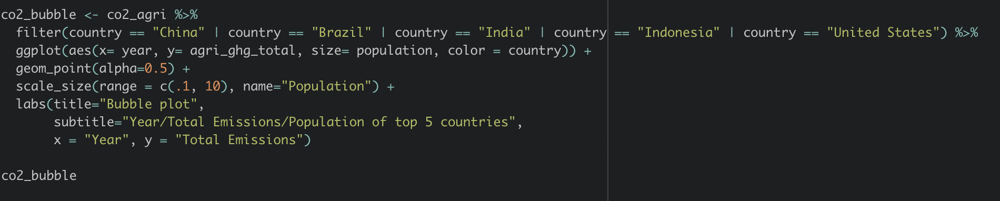

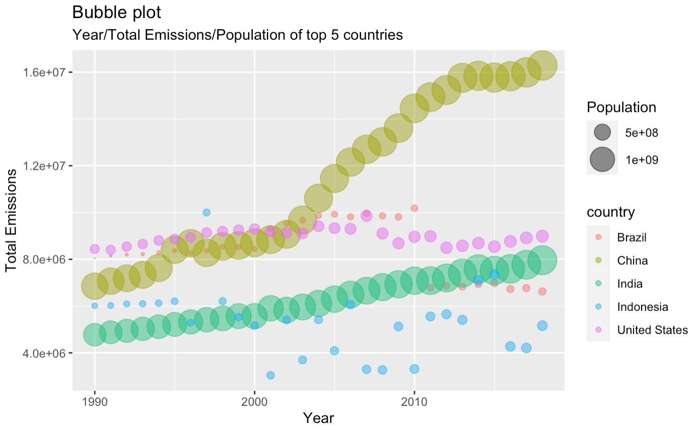

Then, we investigated the relationship between population and total emissions. The size of the bubble points represents the population size of that country. We can see that China has the largest population size, which also has the highest emission level. The extremely large population density is a determinant of China's greenhouse gas emissions. Meanwhile, even though India has nearly the same population size as China, it has much lower greenhouse gas emissions. Also, the US still has a high emission level compared to those countries which have large population sizes. Looking back at the GDP trends of these two countries, we assume the high GDP level of the US contributes to the high emissions. Besides, Brazil and Indonesia present similar patterns of the population size lines as their total emission lines. We concluded that population and total emissions have a positive relationship in most cases.

After analyzing the GDP and population of those countries, we found that the relationships between these two indicators and total emissions have certain patterns but are not definite. We still need to incorporate more indicators in this research to investigate the driving factors of greenhouse gas emissions.

-   1.4 Relationship between energy consumption and greenhouse gas emissions

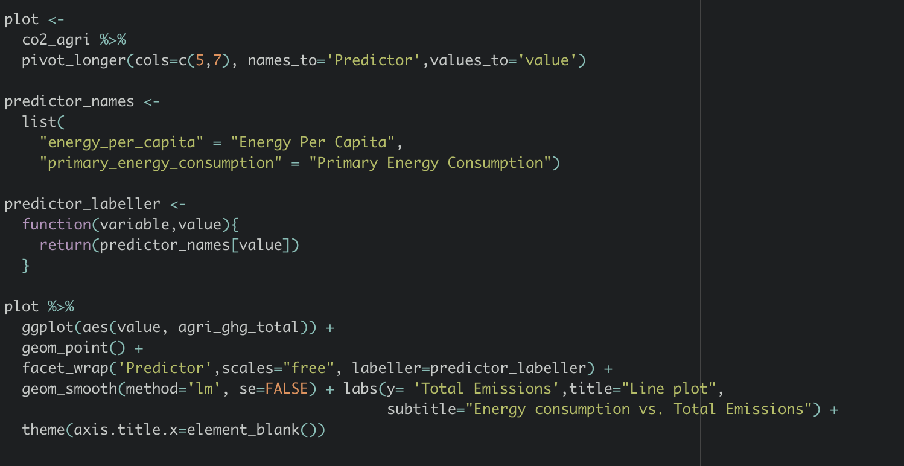

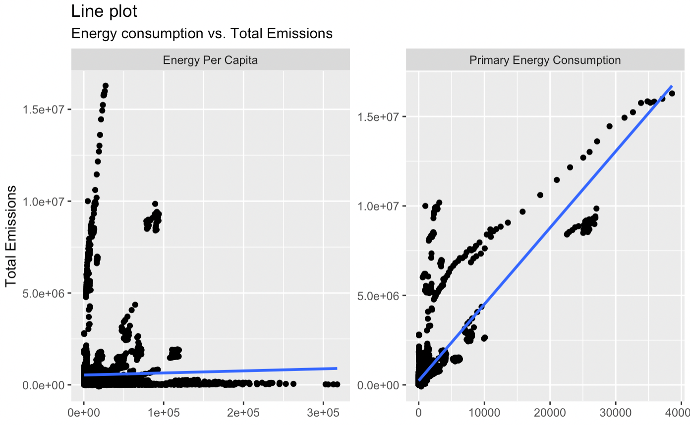

We plotted the primary energy consumption versus the total greenhouse gas emission and energy per capita versus the total greenhouse gas emission in this graph. We added trend lines to see how they correlate. It shows that a higher energy consumption corresponds to a higher emission. Energy use is the foundation of development, and every economic activity requires such input. The relationship between energy per capita and total greenhouse gas emission is slightly positive, which is a less obvious trend than total energy consumption.

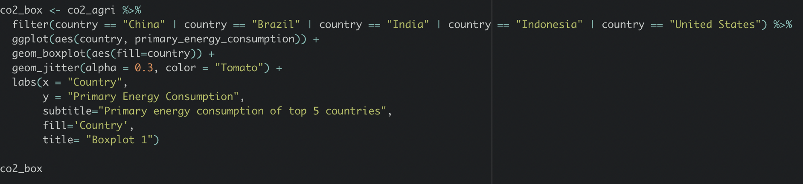

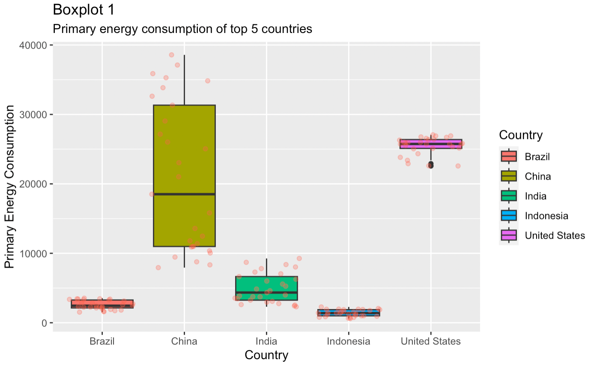

This plot maps out the distribution of total energy used in each country between 1990-2018. The red dots represent the raw data point, and the box represents the average as well as the range of the data. The United States and China exhibit relatively higher energy use than others. It is noticeable that China and India's energy use has been changing over the years, resulting in a longer box which means that the distribution is spread out. We thought that population increase could impact the trend, so we plotted the energy per capita to ensure the trend was still valid.

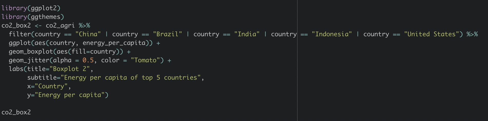

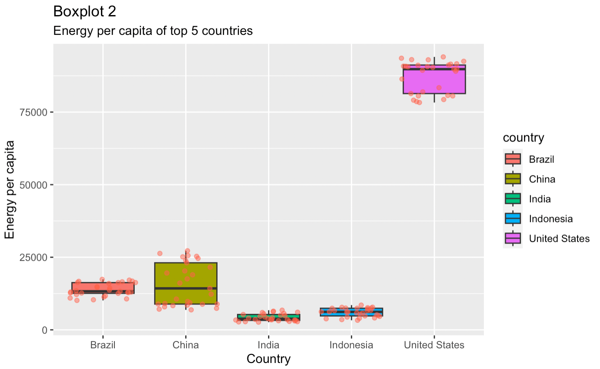

